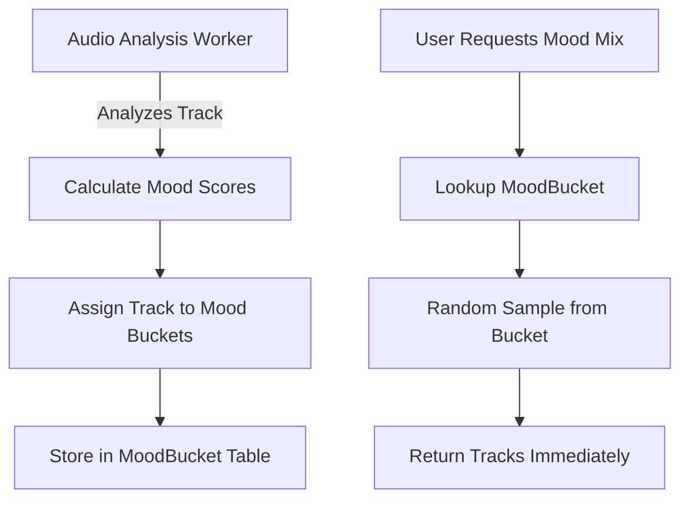

# Mood Mixer Complete Overhaul Plan

**Date:** 2025-12-26
**Status:** Planning
**Priority:** High

---

## Executive Summary

The current Mood Mixer implementation has fundamental architectural issues causing slow generation, stale UI, and poor user experience. This document outlines a complete overhaul to create a simpler, faster, and more reliable mood-based playlist system.

---

## Current Problems

### 1. Slow Generation

**Root Cause:** The [`generateMoodOnDemand()`](backend/src/services/programmaticPlaylists.ts:3104) function:

-   Queries the entire track table with complex WHERE clauses
-   Has a two-pass approach: first checks enhanced track count, then queries again
-   Falls back to basic audio features with complex mapping logic
-   No database indexes on mood-related columns

### 2. UI Not Updating

**Root Cause:** Multiple issues in the React Query cache system:

-   [`useHomeData`](frontend/features/home/hooks/useHomeData.ts:84-91) listens for `mixes-updated` event
-   `queryClient.invalidateQueries()` only marks data as stale, doesn't force immediate refetch
-   The 5-minute stale time in [`useMixesQuery`](frontend/hooks/useQueries.ts:461-466) means UI may not update immediately

### 3. Stale Card Persists

**Root Cause:** The mood mix always has ID `"your-mood-mix"` regardless of content:

-   [`generateAllMixes()`](backend/src/services/programmaticPlaylists.ts:497-505) creates mix with static ID
-   [`MixCard`](frontend/components/MixCard.tsx:81-83) memo comparison only checks `mix.id`
-   When user changes mood, the mix content changes but ID stays same, so React doesn't re-render

---

## New Architecture Design

### Core Principle: Pre-computed Mood Buckets

Instead of querying tracks with complex filters at runtime, we pre-compute mood buckets during audio analysis and store track-to-mood mappings.



### New Database Schema

```prisma
// New model to store pre-computed mood assignments
model MoodBucket {
  id        String   @id @default(uuid())
  trackId   String
  track     Track    @relation(fields: [trackId], references: [id], onDelete: Cascade)
  mood      String   // happy, sad, chill, energetic, party, focus, melancholy, aggressive, acoustic
  score     Float    // Confidence score 0-1
  createdAt DateTime @default(now())
  updatedAt DateTime @updatedAt

  @@unique([trackId, mood])
  @@index([mood, score])
  @@index([trackId])
}

// User's active mood mix selection
model UserMoodMix {
  id            String   @id @default(uuid())
  userId        String   @unique
  user          User     @relation(fields: [userId], references: [id], onDelete: Cascade)
  mood          String   // The selected mood
  trackIds      String[] // Cached track IDs for the mix
  coverUrls     String[] // Cached cover URLs
  generatedAt   DateTime // When this mix was generated
  createdAt     DateTime @default(now())
  updatedAt     DateTime @updatedAt

  @@index([userId])
}
```

### Mood Categories

Simplified to 9 core moods that map from audio features:

| Mood           | Primary Features               | Fallback Criteria                       |
| -------------- | ------------------------------ | --------------------------------------- |
| **Happy**      | moodHappy >= 0.5               | valence >= 0.6, energy >= 0.5           |
| **Sad**        | moodSad >= 0.5                 | valence <= 0.35, keyScale = minor       |
| **Chill**      | moodRelaxed >= 0.5             | energy <= 0.5, arousal <= 0.5           |
| **Energetic**  | arousal >= 0.6, energy >= 0.7  | bpm >= 120, energy >= 0.7               |
| **Party**      | moodParty >= 0.5               | danceability >= 0.7, energy >= 0.6      |
| **Focus**      | instrumentalness >= 0.5        | instrumentalness >= 0.5, energy 0.2-0.6 |
| **Melancholy** | moodSad >= 0.4, valence <= 0.4 | valence <= 0.35, keyScale = minor       |
| **Aggressive** | moodAggressive >= 0.5          | energy >= 0.8, arousal >= 0.7           |
| **Acoustic**   | moodAcoustic >= 0.5            | acousticness >= 0.6, energy 0.3-0.6     |

---

## Implementation Plan

### Phase 1: Database & Backend Changes

#### 1.1 Create New Database Schema

-   Add MoodBucket and UserMoodMix models to Prisma schema
-   Create migration
-   Add database indexes for fast mood lookups

#### 1.2 Create Mood Bucket Population Worker

-   New worker that runs after audio analysis completes
-   Calculates mood scores and assigns tracks to buckets
-   Handles both enhanced mode and standard mode tracks

#### 1.3 Backfill Existing Tracks

-   One-time job to populate MoodBucket for all analyzed tracks
-   Should be idempotent and resumable

#### 1.4 Simplify Mood Mix API

-   New endpoint: `GET /mixes/mood/:mood` - Get a mix for a specific mood
-   New endpoint: `POST /mixes/mood/:mood/save` - Save as user's active mood mix
-   Deprecate complex parameter-based generation

### Phase 2: Frontend Changes

#### 2.1 Redesign MoodMixer Component

-   Simple grid of mood buttons instead of sliders
-   Instant feedback - show loading state per mood
-   Remove advanced ML mood controls

#### 2.2 Fix Cache Invalidation

-   Use `refetchQueries` instead of `invalidateQueries` after saving
-   Add timestamp to mix ID to force re-render
-   Remove memoization comparison that only checks ID

#### 2.3 Improve Home Page Mix Display

-   Add unique key based on content hash, not just ID
-   Show loading skeleton while refetching
-   Optimistic update - show new mood immediately

### Phase 3: Optimization & Cleanup

#### 3.1 Add Performance Monitoring

-   Log generation times
-   Track cache hit rates
-   Monitor database query performance

#### 3.2 Remove Legacy Code

-   Remove `generateMoodOnDemand()` complex logic
-   Remove ML mood parameter fallback system
-   Clean up unused presets

#### 3.3 Documentation

-   Update API documentation
-   Add architecture decision record

---

## Detailed Task Breakdown

### Backend Tasks

| Task | File                                    | Description                                 |
| ---- | --------------------------------------- | ------------------------------------------- |
| B1   | `prisma/schema.prisma`                  | Add MoodBucket and UserMoodMix models       |
| B2   | `prisma/migrations/`                    | Create and run migration                    |
| B3   | `src/workers/moodBucketWorker.ts`       | New worker to populate mood buckets         |
| B4   | `src/services/moodBucketService.ts`     | New service for mood bucket operations      |
| B5   | `src/routes/mixes.ts`                   | Add new simplified mood endpoints           |
| B6   | `src/routes/mixes.ts`                   | Deprecate old `/mood` POST endpoint         |
| B7   | `src/services/programmaticPlaylists.ts` | Refactor generateAllMixes to use MoodBucket |
| B8   | One-time script                         | Backfill existing tracks to MoodBucket      |

### Frontend Tasks

| Task | File                                     | Description                             |
| ---- | ---------------------------------------- | --------------------------------------- |
| F1   | `components/MoodMixer.tsx`               | Complete redesign with simple mood grid |
| F2   | `hooks/useQueries.ts`                    | Add new mood mix queries                |
| F3   | `features/home/hooks/useHomeData.ts`     | Fix cache invalidation with refetch     |
| F4   | `components/MixCard.tsx`                 | Fix memo comparison to include content  |
| F5   | `features/home/components/MixesGrid.tsx` | Add proper key generation               |
| F6   | `lib/api.ts`                             | Add new mood mix API methods            |

### Database Tasks

| Task | Description                                                               |
| ---- | ------------------------------------------------------------------------- |
| D1   | Create indexes on Track table: mood columns, analysisStatus, analysisMode |
| D2   | Create MoodBucket table with proper indexes                               |
| D3   | Create UserMoodMix table                                                  |

---

## New API Design

### GET /mixes/mood/presets

Returns available mood presets with metadata.

```typescript
interface MoodPreset {
    id: string; // happy, sad, chill, etc.
    name: string; // "Happy & Upbeat"
    color: string; // Gradient CSS
    icon: string; // Lucide icon name
    trackCount: number; // Available tracks for this mood
}
```

### GET /mixes/mood/:mood

Get a pre-generated mix for a specific mood.

```typescript
// Response
interface MoodMixResponse {
    id: string; // "mood-happy-{timestamp}"
    mood: string;
    name: string;
    description: string;
    trackIds: string[];
    tracks: Track[]; // Full track details
    coverUrls: string[];
    trackCount: number;
    color: string;
}
```

### POST /mixes/mood/:mood/save

Save as user's active mood mix. Returns the saved mix and triggers cache invalidation.

```typescript
// Response
interface SaveMoodMixResponse {
    success: true;
    mix: {
        id: string; // "your-mood-mix-{timestamp}"
        mood: string;
        name: string; // "Your Happy Mix"
        trackIds: string[];
        coverUrls: string[];
        generatedAt: string;
    };
}
```

---

## New MoodMixer Component Design

### Visual Layout

```
┌──────────────────────────────────────────────────────────────┐
│  🎵 Mood Mixer                                           ✕   │
│  Pick a vibe and we'll create a mix for you                  │
├──────────────────────────────────────────────────────────────┤
│                                                              │
│  ┌──────────┐  ┌──────────┐  ┌──────────┐  ┌──────────┐     │
│  │  😊      │  │  😢      │  │  😌      │  │  ⚡      │     │
│  │  Happy   │  │  Sad     │  │  Chill   │  │ Energetic│     │
│  │  42 🎵   │  │  28 🎵   │  │  56 🎵   │  │  31 🎵   │     │
│  └──────────┘  └──────────┘  └──────────┘  └──────────┘     │
│                                                              │
│  ┌──────────┐  ┌──────────┐  ┌──────────┐  ┌──────────┐     │
│  │  🎉      │  │  🎯      │  │  🌧️      │  │  🔥      │     │
│  │  Party   │  │  Focus   │  │Melancholy│  │Aggressive│     │
│  │  45 🎵   │  │  22 🎵   │  │  19 🎵   │  │  15 🎵   │     │
│  └──────────┘  └──────────┘  └──────────┘  └──────────┘     │
│                                                              │
│  ┌──────────┐                                                │
│  │  🎸      │                                                │
│  │ Acoustic │                                                │
│  │  33 🎵   │                                                │
│  └──────────┘                                                │
│                                                              │
└──────────────────────────────────────────────────────────────┘
```

### Component Behavior

1. **On Open:** Fetch mood presets with track counts
2. **On Click:**
    - Show loading spinner on clicked mood
    - Call `POST /mixes/mood/:mood/save`
    - Start playing the mix immediately
    - Close modal
    - Home page automatically refetches mixes
3. **Track Count:** Shows how many tracks are available for each mood
4. **Disabled State:** Moods with < 8 tracks are grayed out

---

## Migration Strategy

### Phase 1: Backend First

1. Deploy database schema changes
2. Deploy new endpoints alongside existing ones
3. Run backfill job in background
4. Both old and new endpoints work

### Phase 2: Frontend Switch

1. Deploy new MoodMixer component
2. New component uses new endpoints
3. Old endpoints still available for existing clients

### Phase 3: Cleanup

1. Remove old `POST /mixes/mood` endpoint
2. Remove complex `generateMoodOnDemand()` function
3. Remove unused presets code

---

## Success Metrics

| Metric                   | Current                            | Target           |
| ------------------------ | ---------------------------------- | ---------------- |
| Mix generation time      | ~2-5 seconds                       | < 200ms          |
| UI update after save     | Often fails                        | Always immediate |
| Code complexity          | ~200 lines in generateMoodOnDemand | ~50 lines        |
| Database queries per mix | 2-4 complex queries                | 1 simple query   |

---

## Risks & Mitigations

| Risk                           | Impact               | Mitigation                                        |
| ------------------------------ | -------------------- | ------------------------------------------------- |
| Backfill takes too long        | Delayed rollout      | Run incrementally, prioritize recently played     |
| Mood bucket data stale         | Poor recommendations | Add trigger on track analysis update              |
| Too few tracks in mood         | Poor UX              | Show track count, disable moods with < 8 tracks   |
| Cache invalidation still fails | User frustration     | Add manual refresh button, use optimistic updates |

---

## Implementation Order

1. **B1, B2, D1-D3:** Database schema and indexes
2. **B3, B4:** Mood bucket worker and service
3. **B8:** Backfill existing tracks
4. **B5:** New API endpoints
5. **F1, F2, F6:** New frontend components and API
6. **F3, F4, F5:** Fix cache and rendering issues
7. **B6, B7:** Refactor existing code to use new system
8. Clean up and documentation

---

## Design Decisions (Confirmed)

1. **Custom slider mode: REMOVED** - Keep the UI simple with just 9 mood buttons. Power users can create regular playlists if they want fine-grained control.
2. **Low track count behavior:** Moods with < 8 tracks will be grayed out and show "Not enough tracks"
3. **Mix position:** User's mood mix will appear first in the "Made For You" section
4. **Analytics:** Not implementing mood selection tracking in this phase - can be added later
